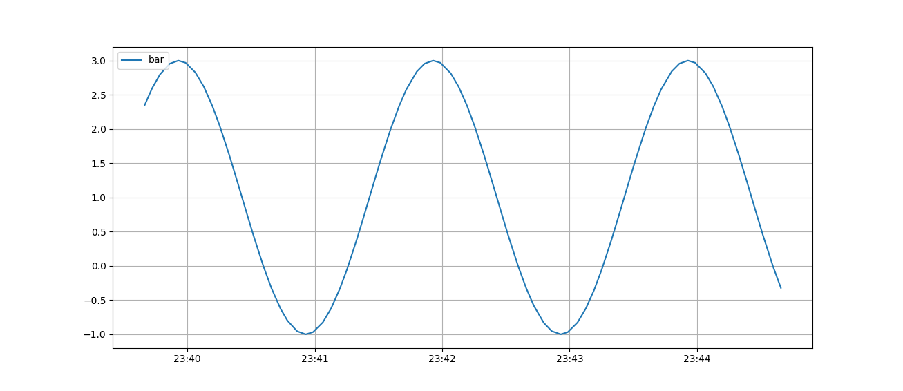
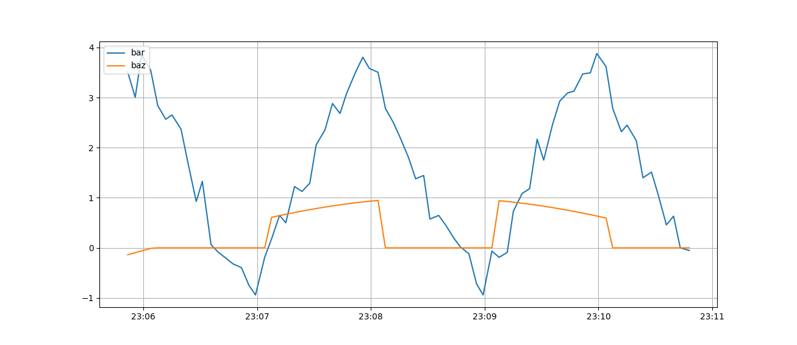

# NoveltyProducer

Use this class to produce artificial data and publish it via mqtt to a specific host.

#### How to start a simple data stream.
~~~py
# import class
from NoveltyProducer.Manager import Manager

# init manager instance
man = Manager()

# create a new pipeline that will send data onto the mqtt topic 'foo' with 15 Hz.
pipe_id = man.create_pipeline('test.mosquitto.org', 1883, 'foo', 15)

# attach a function to the just created pipeline that will produce a 
# sin-wave with an lower bound of -1 and upper bound of 3.
# The sine wave will have an 0.5 Hz frequency.
channel_id = man.add_function(pipe_id, 'bar', [-1, 3], 0.5)
~~~

#### What is streamed.
~~~py
foo b'{"timestamp": "2019-08-28T09:38:55.814337", "bar": 0.5487491837412708}'
foo b'{"timestamp": "2019-08-28T09:38:56.821802", "bar": -0.052118018113447295}'
foo b'{"timestamp": "2019-08-28T09:38:57.805056", "bar": -0.620937663401906}'
foo b'{"timestamp": "2019-08-28T09:38:58.811185", "bar": -0.9641198905685163}'
foo b'{"timestamp": "2019-08-28T09:38:59.817089", "bar": -0.9347151370201041}'
foo b'{"timestamp": "2019-08-28T09:39:00.816615", "bar": -0.5475520657645743}'
~~~

#### How to visualize the data flow.
~~~py
# import class
from NoveltyProducer.Painter import Painter

# init painter instance and listen to specific host ip, port and mqtt topic.
Painter('test.mosquitto.org', 1883, 'foo')
~~~

#### Stack and/or add channels
~~~py
# add noise to the already existing channel 'bar'
noisy_id = man.add_function(pipe_id, 'bar', type_='random')

# add another sine-wave as a new channel 'baz'. 
# this channel has a dead time of 1 second. occuring every 2 seconds.
another_channel_id = man.add_function(pipe_id, 'baz', dead_frequency_=0.5, dead_period_=1)
~~~

#### Stream your own dataset.
~~~py
# import numpy to generate some data
import numpy as np

# it is also possible to replay your own list of datapoints.
data = [np.tanh(x) for x in np.linspace(-2, 2, 100)]

# add new channel or combine channels.
replay_channel_id = man.add_replay(pipe_id, data, 'tanh replay')
~~~

#### What is left to do.
Check out the [TODO.md](https://github.com/frank690/NoveltyProducer/blob/master/TODO.md).
